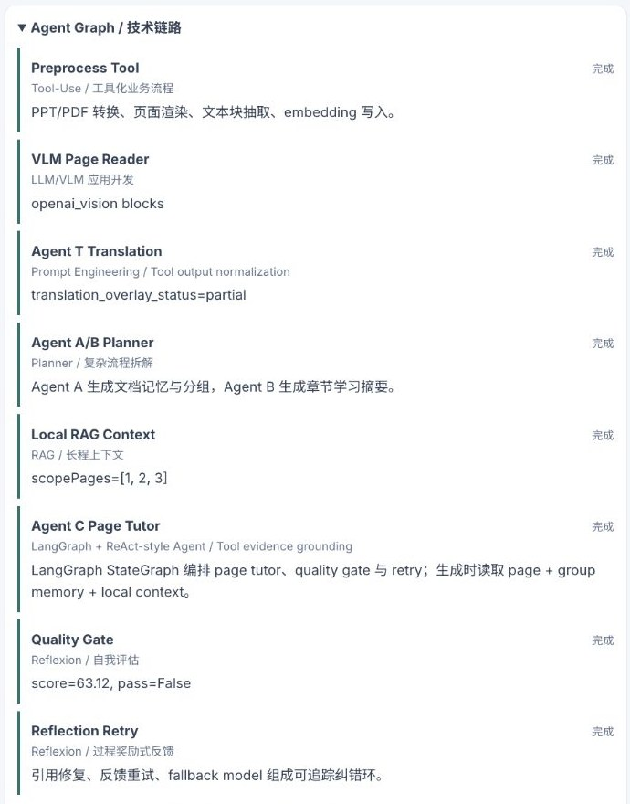

# Study Assistant Agent Workbench

A local `PDF/PPTX` learning assistant that turns course material into rendered pages, translated reading overlays, page-level explanations, citations, and an inspectable Agent Graph.

The project is intentionally built as an AI application workflow rather than a single prompt demo. It separates document preprocessing, VLM page reading, translation, planning, local RAG, page tutoring, quality evaluation, and retry/reflection into visible nodes.



## What It Demonstrates

- `LLM/VLM` application development: text-first document processing with optional OpenAI mini vision augmentation for PPT pages.
- `Tool-Use`: file conversion, page rendering, OCR/formula extraction, VLM page reading, translation overlay, local retrieval, and quality evaluation are modeled as separate tools.
- `Planner`: Agent A/B document and group planning provide global and chapter-level context for page explanations.
- `RAG`: page explanations use current page text plus adjacent/retrieved local context and report `scopePages`.
- `LangGraph`: Agent C uses a real LangGraph `StateGraph` to orchestrate page tutoring, quality gate routing, reflection retry, fallback reasoning, and final trace metadata.
- `ReAct-style grounding`: Agent C explains a page using tool outputs such as page text, layout blocks, citations, local context, and memory.
- `Reflexion / Quality Gate`: explanation output is scored, citation alignment can be repaired, and retry/fallback metadata is visible.

## Current Hybrid Model Routing

The recommended local setup is:

```text
DeepSeek: main reasoning, translation, planning, page explanations, quality-aware structured output
OpenAI gpt-5.4-mini: vision-only page augmentation for PPT/image-heavy pages
```

The vision model name is configurable through `OPENAI_VISION_MODEL`. At the time this demo was verified, the accessible mini vision model was `gpt-5.4-mini`; do not assume `gpt-5.5-mini` exists unless your own OpenAI account lists it.

## Architecture

```text
Upload PDF/PPTX
  -> Preprocess Tool
  -> VLM Page Reader
  -> Translation Overlay
  -> Agent A/B Planner
  -> Local RAG Context
  -> LangGraph Agent C StateGraph
       -> Page Tutor
       -> Quality Gate
       -> Reflection Retry / Fallback
  -> UI Agent Graph
```

Frontend:

- `frontend/`: Next.js / React / TypeScript GUI
- page reader with original, translated, and bilingual modes
- document history, task queue, prompt/settings panels
- Agent Graph panel showing framework mapping and model chain

Backend:

- `backend/`: FastAPI / SQLite document pipeline
- upload, conversion, page extraction, translation overlay
- DeepSeek/OpenAI/Gemini-compatible model adapters
- auth, per-user settings, prompt profiles, fallback chains
- explanation quality scoring, citation repair, and run metadata
- LangGraph `StateGraph` orchestration for Agent C quality/retry state transitions

## Verified Demo Result

A 3-page PPTX demo was processed locally with:

- `DeepSeek deepseek-chat` for main Agent C explanation
- `OpenAI gpt-5.4-mini` for VLM page augmentation
- page 2 produced `23` `openai_vision` layout blocks
- page 2 quality gate passed with score `92.97`
- page 2 reported `scopePages=[1, 2, 3]`
- UI displayed:

```text
deepseek:deepseek-chat:agent_c -> flash-citation-repair -> openai:gpt-5.4-mini:vision
```

## Quick Start

### Backend

```bash
cd backend
python3 -m venv .venv
. .venv/bin/activate
pip install -e '.[dev]'
cp .env.example .env
```

Edit `backend/.env` or export environment variables in your shell. Prefer `*_API_KEY_PATH` for local secrets:

```bash
export LLM_PROVIDER=deepseek
export LLM_DEFAULT_PROVIDER=deepseek
export DEEPSEEK_API_KEY_PATH=/absolute/path/to/deepseek-key
export DEEPSEEK_MODEL=deepseek-chat
export OPENAI_API_KEY_PATH=/absolute/path/to/openai-key
export OPENAI_VISION_MODEL=gpt-5.4-mini
export ADMIN_PASSWORD='change-me-before-sharing-123'
```

Start the backend:

```bash
uvicorn app.main:app --reload --host 127.0.0.1 --port 8000
```

### Frontend

```bash
cd frontend
npm install
cp .env.example .env.local
npm run dev -- --port 3000
```

Open `http://127.0.0.1:3000`.

If you upload PPTX files, install LibreOffice and make sure `soffice` is available on your `PATH`.

## Configuration Notes

- Never commit real `.env`, API keys, SQLite databases, `.runtime`, or `output/`.
- Auth is enabled by default. Set a real `ADMIN_PASSWORD` before sharing or deploying.
- `AUTH_REGISTRATION_MODE` can be `open`, `invite`, or `closed`.
- Shared model keys can be configured globally, while users can also save encrypted personal keys.

## Validation

Backend:

```bash
cd backend
. .venv/bin/activate
pytest -q
```

Frontend:

```bash
cd frontend
npm run build
```

The current public-safe version was checked with the full backend test suite and a production frontend build.

## Project Scope

This repository is a local engineering prototype for an inspectable Agent workflow:

- It is not just a chatbot wrapper.
- It exposes tool nodes, model routing, page evidence, local context, quality scoring, and retry metadata.
- It is currently a local MVP, not a production SaaS.
- The core technical path is the working `LLM/VLM + Tool-Use + RAG + LangGraph + Quality Gate` pipeline.

See [PROJECT_CASE_STUDY.md](PROJECT_CASE_STUDY.md) for a deeper technical walkthrough.
